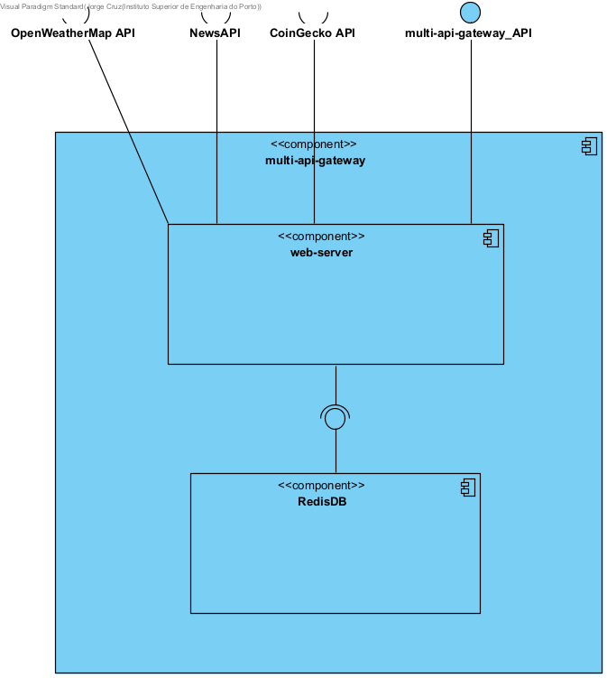

# 🌐 multi-api-gateway

A **Node.js + TypeScript** service that aggregates multiple external APIs (Weather, News, Cryptocurrency) into a single gateway.  
Responses are cached in **Redis** to improve speed and reduce API call limits.

## 🚀 Features
- Fetches and merges data from:
  - [OpenWeatherMap API](https://openweathermap.org/api)
  - [NewsAPI](https://newsapi.org/)
  - [CoinGecko API](https://www.coingecko.com/en/api)
- Unified API gateway (`/api/...`) for clients
- Built-in caching with **Redis**
- Lightweight **Express.js** server
- Ready for containerization (Docker support planned)

## 🏗 Architecture

## 📦 Tech Stack
- [Node.js](https://nodejs.org/)
- [TypeScript](https://www.typescriptlang.org/)
- [Express.js](https://expressjs.com/)
- [Redis](https://redis.io/)
- [Nodemon](https://nodemon.io/) for development